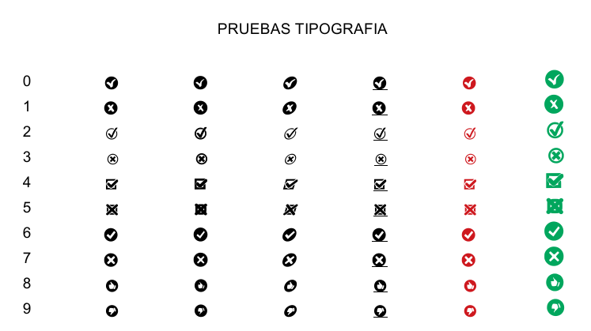

# Tipografía

___Tipografía Ok Fail___

Caracteres definidos: Ok fail Ok fail

Las letras seria tecleando 01234, ejemplo:

Autor:
Julio Sánchez Berro

Link:
https://jsbsan.blogspot.com/2023/02/tipografia-tipo-de-letra-okfailure.html
